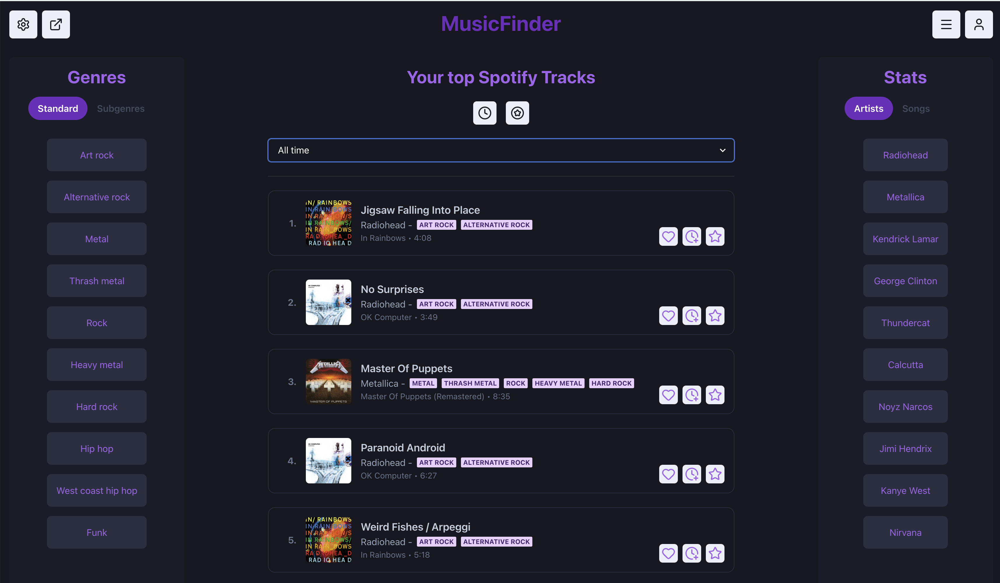
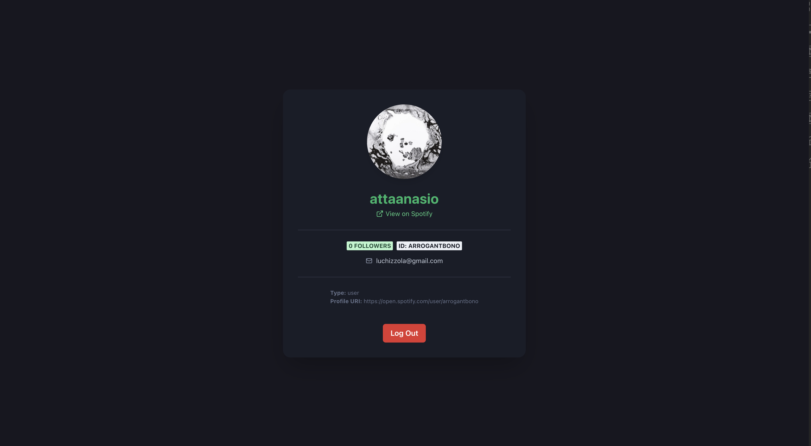

# MusicFinder 🎵
MusicFinder is a full-stack MERN app that connects to the Spotify API, authenticates users through OAuth, tracks listening activity, stores saved songs and genres in MongoDB, and generates personalized recommendations.  
Work in progress — messaging, external recommendation engine, and more features coming soon.

---
## Screenshots

### Dashboard


### Profile View

---
## Features
- 🔐 'Spotify OAuth Login' — secure Authorization Code flow  
- 🎧 Automatic sync of:
  - user profile  
  - top tracks  
  - top artists  
  - recently played tracks  
  - genre distribution  
- 🗄️ MongoDB storage of all listening data  
- 🎼 Spotify-based recommendations (sorting, filtering)  
- 🔍 Search for tracks, artists, albums  
- 💬 Instant messaging via Socket.IO (in progress)

---

## Tech Stack

### Frontend
- React + TypeScript  
- Vite  
- Chakra UI  
- Axios
  
### Backend
- Node.js + Express  
- Spotify Web API  
- MongoDB + Mongoose  
- dotenv  
- JWT  
- Socket.IO (WIP)

---

## Project Structure

```text
MusicFinder/
│
├── client/               # Frontend (React + Vite)
│   ├── src/
│   └── ...
│
├── server/               # Backend (Express, Spotify, MongoDB)
│   ├── models/
│   ├── controllers/
│   ├── routes/
│   ├── auth/
│   ├── server.cjs
│   └── ...
│
└── README.md
```

---

## Environment Variables

Create a .env inside /server:

```env
MONGO_URI=your-mongo-url
FRONTEND_URL=http://localhost:5173
SPOTIFY_CLIENT_ID=your-client-id
SPOTIFY_CLIENT_SECRET=your-secret
SPOTIFY_REDIRECT_URI=http://localhost:3000/auth/spotify/callback
NGROK_URL=
JWT_SECRET=your-jwt-secret
```

---

## Spotify Auth Flow

1. User clicks Login with Spotify  
2. Redirect to Spotify OAuth page  
3. Spotify redirects back with a `code`  
4. Server exchanges code → access + refresh tokens  
5. Server fetches:  
   - profile  
   - top tracks  
   - top artists  
   - genres  
   - recently played  
6. Data is stored in MongoDB for quick access and history tracking

---

## API Overview

### Auth
```text
POST /signup                    → Create account
POST /login                     → Email/password login
GET  /auth/google               → Google OAuth login
GET  /userByToken/:token        → Fetch logged-in user
```

### Users
```text
GET  /allUsers/:userId          → Get all users except self/friends
POST /changeFriendStatus        → Add or remove a friend
```
### Games
```text
GET  /gameStatus?userId&gameId  → Fetch collection/wishlist status
POST /changeGameStatus          → Add or remove from collection/wishlist
```
### Reviews
```text
GET  /reviews/:gameId           → Fetch reviews for a game
POST /addReview                 → Add a review
POST /deleteReview              → Delete a review
```
### Environment Variables
```text
Create a secret.js file inside /server and populate Mongo + JWT secrets
```
---

## Future Improvements
- Real-time messaging (Socket.IO)  
- External recommendation engine (custom ML/AI)  
- Taste similarity scores  
- Collaborative playlists  
- Music sharing  
- Listening analytics  
- Genre clustering visualizations  

---

## Work in Progress 🚧

Follow development here:  
https://github.com/attanasioluca/MusicFinder
